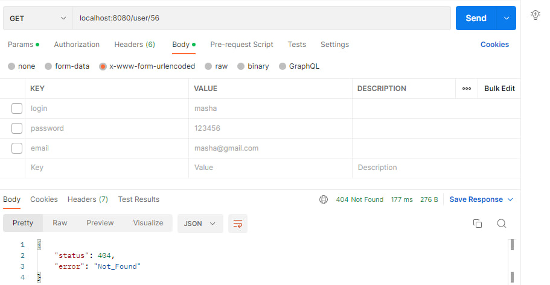
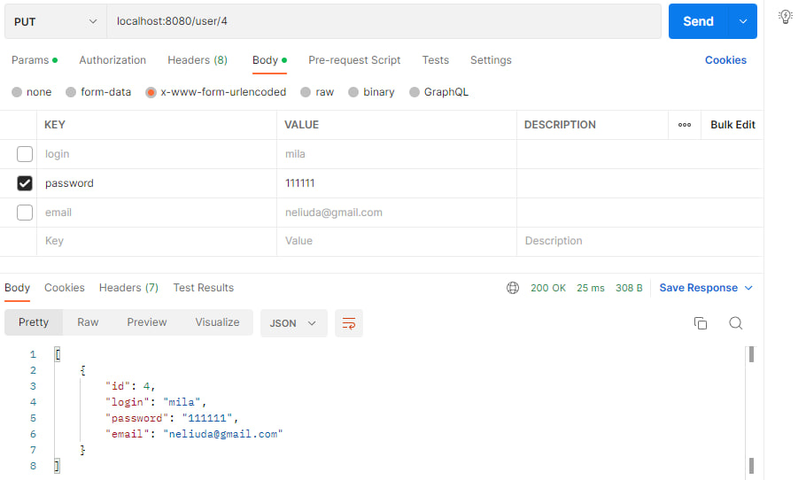

# Тестування працездатності системи

Тестування проводиться за допомогою утиліти Postman.

## Відображення усіх сутностей

_Тестування проводиться на базі даних з таблицею User з наявними записами_

## Додавання сутності

_Видається помилка, якщо одне з потрібних полів не вказано_

_Успішне додавання сутності_

_Зчитування доданої сутності_

_Видається помилка, якщо сутність з таким email вже існує_

## Зчитування сутності за id

_Видається помилка, якщо сутність з таким id не існує_

_Зчитування сутності за id_

## Оновлення сутності за id

_Видається помилка, якщо сутність з таким id не існує_

_Оновлення сутності з вказанням усіх полів_

_Видається помилка, якщо в полі email не електронна адреса_

_Видається помилка, якщо сутність з таким email вже існує_

_Оновлення сутності з вказанням тільки поля email_

_Оновлення сутності з вказанням тільки поля password_

_Оновлення сутності з вказанням тільки поля login_

## Видалення сутності

_Видається помилка, якщо сутність з таким id не існує_

_Видалення сутності_

_Видаленої сутності тепер немає в базі даних_

